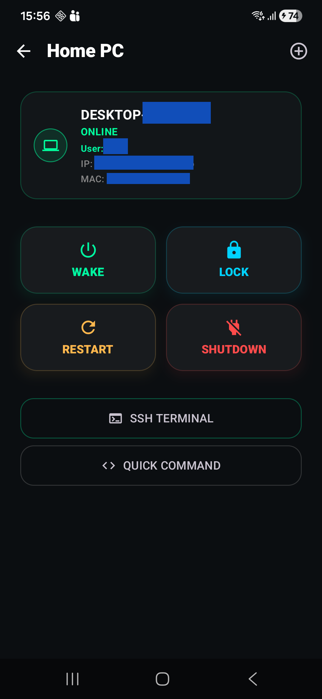
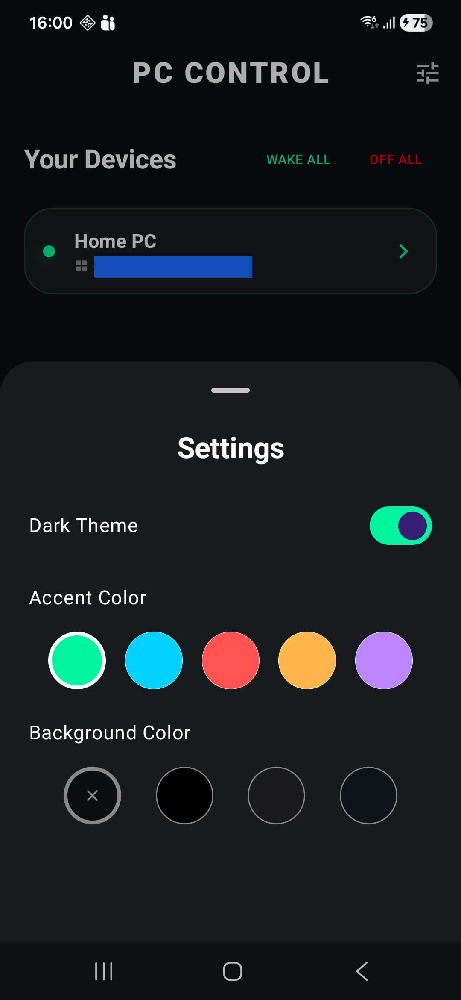
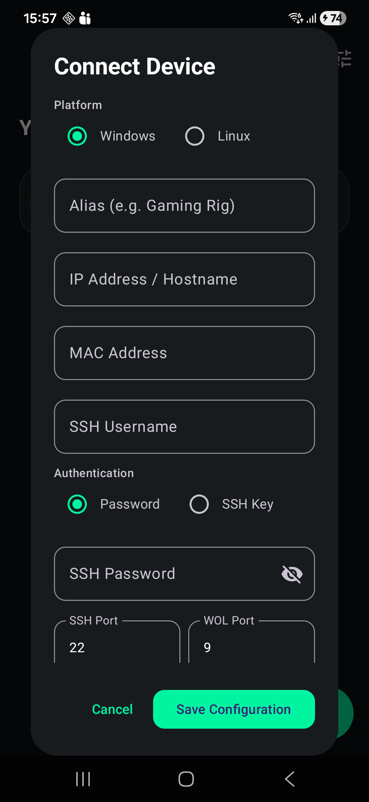
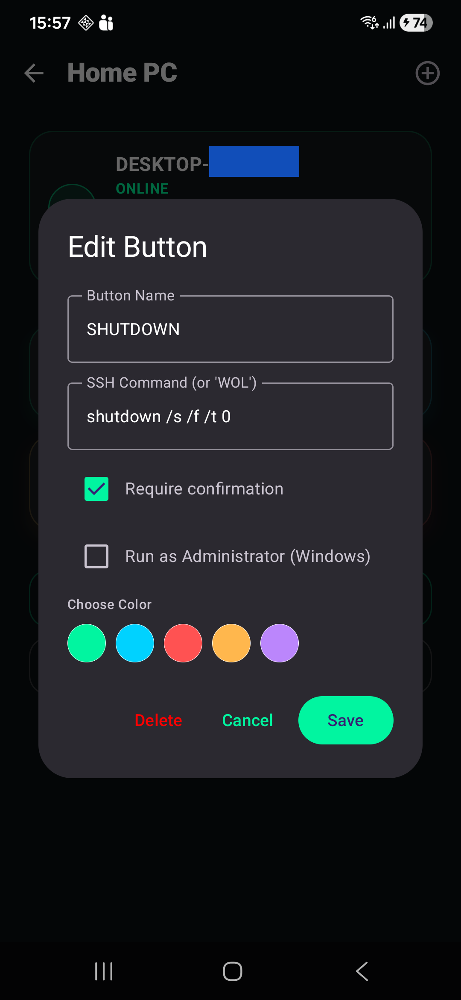
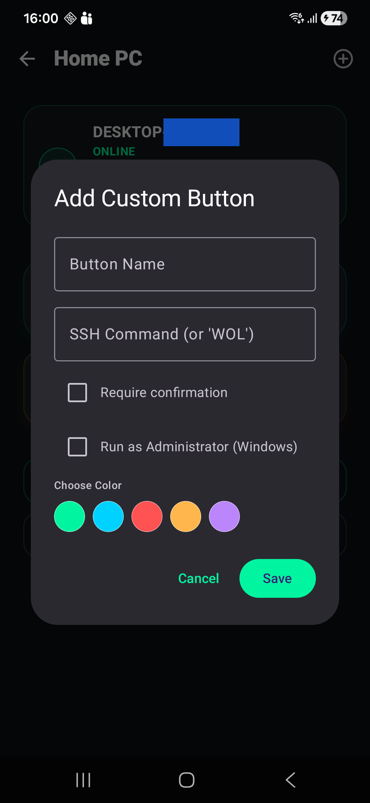

# PC Control 🖥️📱

A professional, modern Android application built with **Jetpack Compose** to remotely manage your PC (Windows/Linux) via SSH and Wake-on-LAN. Featuring a highly customizable UI and robust command execution.

---

## ✨ Features

- **🚀 Remote Power Control**: Wake up your PC via WoL, Lock the screen, Restart, or Shutdown with a single tap.
- **🛠️ Custom Command Buttons**: Create your own SSH command buttons with custom icons, colors, and Admin privileges.
- **🖐️ Drag-and-Drop Reordering**: Fully interactive dashboard—reorder your devices and command buttons with smooth snapping animations.
- **📟 Integrated SSH Terminal**: A built-in terminal for running live commands and viewing real-time output.
- **🛡️ Secure Connection**: Supports modern **Ed25519** SSH keys and password authentication.
- **⚡ Admin Support**: Execute Windows commands as Administrator using integrated PowerShell elevation.
- **🎨 UI Customization**: Deep personalization with custom accent colors, Dark/Light themes, and selectable background colors.
- **🧹 Modular Architecture**: Cleanly separated logic and UI for high performance and maintainability.

---

## 📸 Screenshots

| Device Dashboard | Device Details | Settings & Themes |
| :---: | :---: | :---: |
|  |  |  |

| Add Device | Edit Button | Add Custom Button |
| :---: | :---: | :---: |
|  |  |  |

---

## 🛠️ Technical Stack

- **UI**: Jetpack Compose (Material 3)
- **SSH Library**: [ConnectBot sshlib](https://github.com/connectbot/sshlib) (v2.2.46 - Optimized for Android)
- **Networking**: Datagram sockets for WoL, standard TCP for SSH
- **Animations**: Compose Animation (Shaking reorder effect, smooth snapping)
- **Architecture**: Modular refactoring (Logic, Screens, Components, Data Models)

---

## 🚀 Getting Started

### Prerequisites
- Your PC must have an **SSH Server** enabled (e.g., OpenSSH on Windows).
- For **Wake-on-LAN**, ensure it is enabled in your PC's BIOS/UEFI and Network Adapter settings.

### Installation
1. Build the APK in Android Studio (**Build > Build APK(s)**).
2. Locate the file at `app/build/outputs/apk/debug/app-debug.apk`.
3. Install it on your Android device.
4. Open the app, click the **+** button, and enter your PC details.

---

## 📝 Windows Setup Tips

To ensure full functionality on Windows:
- **Locking**: The app uses `schtasks` to bypass Session 0 isolation, ensuring the lock command hits the interactive user session.
- **Admin Commands**: When a button is set to "Run as Admin", the app wraps the command in:
  `powershell -Command "Start-Process powershell -ArgumentList '-Command', '...' -Verb RunAs"`
- **SSH Configuration**: Ensure your OpenSSH server allows PTY allocation for interactive command support.

---

## 📄 License
This project is licensed under the MIT License.
