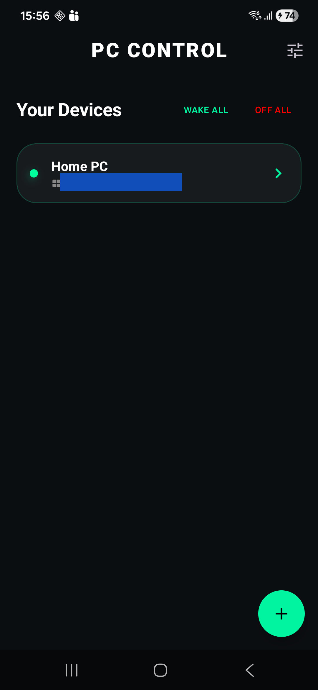

# PC Control 🖥️📱

A professional, modern Android application built with **Jetpack Compose** to remotely manage your PC (Windows/Linux) via SSH and Wake-on-LAN.

---

## ✨ Features

- **🚀 Remote Power Control**: Wake up your PC via WoL, Lock the screen, Restart, or Shutdown with a single tap.
- **🛠️ Custom Command Buttons**: Create your own SSH command buttons with custom icons and colors.
- **🖐️ Drag-and-Drop Reordering**: Fully interactive dashboard—reorder your devices and command buttons easily.
- **📟 Integrated SSH Terminal**: A built-in terminal for running live commands and viewing real-time output.
- **🛡️ Secure Connection**: Supports modern **Ed25519** SSH keys and password authentication.
- **⚡ Admin Support**: Execute Windows commands as Administrator using integrated PowerShell elevation.
- **🎨 UI Customization**: Change accent colors, toggle Dark/Light themes, and set custom background colors.
- **🧹 Modular Architecture**: Refactored for clean code and high performance.

---

## 📸 Screenshots

| Device Dashboard | Command Selection | Interactive Terminal |
| :---: | :---: | :---: |
|  |  |  |

*(Add your captured screenshots to a `screenshots` folder in this repository!)*

---

## 🛠️ Technical Stack

- **UI**: Jetpack Compose (Material 3)
- **SSH Library**: [ConnectBot sshlib](https://github.com/connectbot/sshlib) (Optimized for Android)
- **Networking**: Datagram sockets for WoL, standard TCP for SSH
- **Animations**: Compose Animation (Shaking reorder effect, smooth snapping)
- **Refactoring**: Clean separation of Logic (SSH/WoL) and UI (Components/Screens)

---

## 🚀 Getting Started

### Prerequisites
- Your PC must have an **SSH Server** enabled (e.g., OpenSSH on Windows).
- For **Wake-on-LAN**, ensure it is enabled in your PC's BIOS/UEFI and Network Adapter settings.

### Installation
1. Download the latest `app-debug.apk` from the [releases](../../releases) section (or build it yourself in Android Studio).
2. Install it on your Android device.
3. Open the app, click the **+** button, and enter your PC details (IP, MAC, User, and SSH Key/Pass).

---

## 📝 Windows Setup Tips

To get the most out of the **Lock** and **Admin** features:
- **Locking**: Uses `schtasks` to bypass Session 0 isolation.
- **Admin Commands**: When a button is set to "Run as Admin", the app uses:
  `powershell -Command "Start-Process powershell -ArgumentList '-Command', '...' -Verb RunAs"`

---

## 🤝 Contributing
Feel free to fork this project and submit PRs for any improvements!

## 📄 License
This project is licensed under the MIT License.
